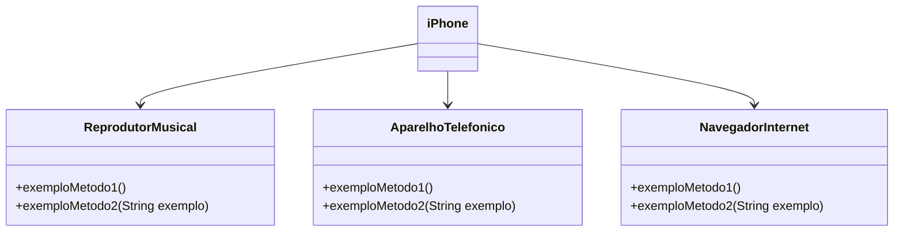

# 📱 Projeto iPhone 2007 - Modelagem e Implementação em Java

Este projeto tem como objetivo modelar, diagramar e implementar em Java o **componente iPhone**, conforme apresentado no evento de lançamento do iPhone em 2007. A proposta inclui a representação das funcionalidades de **reprodutor musical**, **aparelho telefônico** e **navegador de internet**, utilizando os princípios de **Programação Orientada a Objetos** com interfaces e classes.

---

## 🎯 Objetivo

- Criar um **diagrama UML** que represente as funcionalidades do iPhone com base em sua apresentação oficial.
- Implementar interfaces e uma classe concreta em Java que simulem essas funcionalidades.

---
## 💡 Funcionalidades Modeladas

### 🔊 Reprodutor Musical
- `tocar()`
- `pausar()`
- `selecionarMusica(String musica)`

### 📞 Aparelho Telefônico
- `ligar(String numero)`
- `atender()`
- `iniciarCorreioVoz()`

### 🌐 Navegador na Internet
- `exibirPagina(String url)`
- `adicionarNovaAba()`
- `atualizarPagina()`

---

## ✅ Exemplo de Uso

```java
var iphone = new Iphone();

iphone.exibirPagina("https://www.iphone.com.br");
iphone.adicionarNovaAba();
iphone.atualizarPagina();

iphone.ligar("11 23333-4444");
iphone.atender();
iphone.iniciarCorreioVoz();

iphone.tocar();
iphone.pausar();
iphone.selecionarMusica("Don't stop me now - Queen");
```
---

## 🖼️ Diagrama UML



### 🧩 Descrição do Diagrama de Classes
O diagrama representa a arquitetura orientada a objetos do componente iPhone, que implementa múltiplas funcionalidades por meio de interfaces separadas. O objetivo é promover o princípio da separação de responsabilidades, facilitando a manutenção e a extensibilidade do sistema.

#### 📱 Classe iPhone
Classe concreta que representa o dispositivo.

Implementa três interfaces distintas, agregando funcionalidades multimídia, telefonia e navegação.


#### 🎵 Interface ReprodutorMusical
Define operações típicas de um player de música.

Métodos exemplares:
- `tocar() – reprodução`
- `pausar() – interrupção`
- `selecionarMusica(String musica) – seleção e controle de faixa`

#### ☎️ Interface AparelhoTelefonico
Modela funcionalidades de telefonia.

Métodos exemplares:

- `ligar(String numero) - chamada`
- `atender() - resposta`
- `iniciarCorreioVoz() - correio de voz`

🌐 Interface NavegadorInternet
Representa a capacidade de navegação web do dispositivo.

Métodos exemplares:

- `exibirPagina(String url) - exibição de páginas`
- `adicionarNovaAba() - manipulação de abas`
- `atualizarPagina() - atualização de dados`


🔁 Relacionamentos
A classe iPhone implementa (-->) todas as três interfaces, atuando como uma união concreta dessas responsabilidades.


